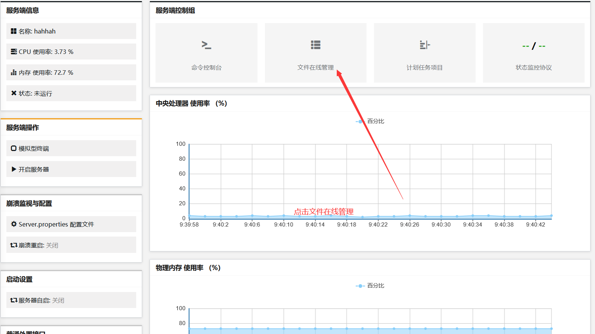

# minecraft bedrock edition for docker
## 1.安装docker以及docker-compose
```bash
apt install docker docker-compose
```
## 2.编写Dockerfile构建docker image
```Dockerfile
 FROM
 ubuntu:latest                                                                                               TZ=Asia/Shanghai
WORKDIR /
 FROM ubuntu:latest                                               
 ENV TZ=Asia/Shanghai
 WORKDIR /
 RUN sed -i 's/archive.ubuntu.com/mirrors.aliyun.com/g' /etc/apt/sources.list \ 
&& apt-get update \
&& ln -snf /usr/share/zoneinfo/$TZ /etc/localtime 
&& echo $TZ > /etc/timezone \
apt-get install -y tzdata unzip wget npm curl \
&& apt-get clean \
&& apt-get autoclean \
&& rm -rf /var/lib/apt/lists/* /tmp/* /var/tmp/*
RUN mkdir /minecraft \
&& mkdir /minecraft/dashboard \
&& mkdir /minecraft/server \
&& wget https://github.com/Suwings/MCSManager/archive/refs/tags/v8.6.23.zip \
#这里的链接复制minecraft管理面板下载链接
&& unzip v8.6.23.zip -d /minecraft/dashboard 
#同样的后面的文件名以及解压的目录名要根据实际情况进行修改
&& mv /minecraft/dashboard/MCSManager-8.6.23/* /minecraft/dashboard 
&& rm -rf /minecraft/dashboard/MCSManager-8.6.23 \
&& apt purge  -y unzip wget \
&& apt autoremove -y \
&& rm /v8.6.23.zip \
&& cd /minecraft/dashboard && npm install
EXPOSE 19132 23333
#对外暴露的端口
ENTRYPOINT cd /minecraft/dashboard/ && npm start
```
## 3.编写docker-compose.yml文件进行启动容器
```yaml
version:"3.9"                                                           
services:
     minecraft:
         container_name: minecraft
         hostname: minecraft
         build: .
         image: minecraft:v1.0
         ports:
             - 19132:19132/udp
             - 19132:23333
             #这里指定需要映射的端口
         volumes:
             ./minecraft:/minecraft/dashboard/server
             #这里指定映射路径
         restart: unless-stopped
```
## 4.&nbsp;使用docker-compose进行构建镜像启动服务
```bash
docker-compose up -d  
(当前所在目录要在存放Dockerfile以及docker-compose.yml文件目录)
```
## 5.访问minecraft控制面板
默认账号为:#master  
默认密码为:123456
(如果服务器部署在公网上,建议修改用户名密码)

  
  





  
编写启动脚本(文件名为之前启动命令中的文件名(可以修改,但要以.sh后缀结尾),这里我们使用start.sh文件名,在脚本中输入以下命令
```bash
#!/bin/bash
chmod +x bedrock_server && chmod +x bedrock_server_realms_debug
#上一条命令为赋予服务器核心文件可执行权限(由于上传文件到服务端默认为无执行权限)
LD_LIBRIARY_PATH=. ./bedrock_server
#这一条命令为指定启动依赖库的路径,后面为启动服务
```  
编写完成之后上传到服务器根目录,上传完成之后,可以启动服务端了  
## 6.关于服务端配置参数  
[查看minecraft详细配置教程](https://bugprogram-git.github.io/MinecraftForDocker.html)
### 6.1关于玩家如何上传自己的资源包  
```bash
#1.找到文件管理根目录
#2.在worlds目录里面创建一个目录(目录名为英文)
#3.上传自己的资源包,并将其解压到上一步创建的目录(如果解压后生成了单独一个新目录,需要将新目录里面的所有文件移动到第二步创建目录的根目录)
#4.处理完成后,第二步创建的目录一定要存在如下几个文件和目录
1.db(目录)  
2.level.dat(文件)
3.level.dat_old(文件)
4.levelname.txt(文件)
#5.找到该目录里面的levelname.txt,将其里面的数据改为第二步创建的目录名称
#6.打开server.properties文件,修改地图名称为第二部创建的目录名称
#7.重启服务器
```
